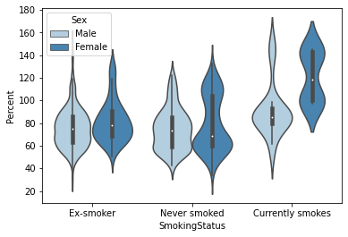

## [Predicting prognosis in patients with pulmonary fibrosis.](https://www.kaggle.com/c/osic-pulmonary-fibrosis-progression)  

#### What is pulmonary fibrosis?  
[Pulmonary fibrosis](https://www.mayoclinic.org/diseases-conditions/pulmonary-fibrosis/symptoms-causes/syc-20353690) is a lung disease that occurs when lung tissue becomes damaged and scarred. This makes it more difficult for lungs to work properly.

In this competition, we predict a patient’s severity of lung function based on a CT scan of their lungs. We’ll determine lung function based on output from a spirometer, which measures the volume of air inhaled and exhaled. The challenge is to use machine learning techniques to make a prediction: final three FVC measurements for each patient, as well as a confidence value in the prediction.   

What is Forced vital capacity (FVC)?    
FVC is the amount of air that can be forcibly exhaled from your lungs after taking the deepest breath possible, as measured by spirometry.  

### Metric.  
The evaluation metric of this competition is a modified version of Laplace Log Likelihood. In medical applications, it is useful to evaluate a model's confidence in its decisions. Accordingly, the metric is designed to reflect both the accuracy and certainty of each prediction.  
For each true FVC measurement, an FVC and a confidence measure (standard deviation σ) are predicted.   

The metric is computed as follows:  
    
  where,
   and
      
  
The error is thresholded at 1000 ml to avoid large errors adversely penalising results, while the confidence values are clipped at 70 ml to reflect the approximate measurement uncertainty in FVC. The final score is calculated by averaging the metric across all test set Patient_Weeks (three per patient).
The metric values will be negative and *higher* is better.   

Predicting an FVC value with high error and low standard deviation leads to large penalties; while predicting with high standard deviation penalises less, relatively. So, if you are confident that your predictions are perfect, you can set sigma to the minimal value so that the penalty is minimised.  

 
### Data description:  
The *training* dataset provides a baseline chest CT scan(dicom files) and associated clinical information(train.csv) for a set of patients. A patient has an image acquired at time Week = 0 and has numerous follow up visits over the course of approximately 1-2 years, at which time their FVC is measured. The *test* dataset provides a baseline CT scan and only the initial FVC measurement(week=0).   
We predict the final three FVC measurements for each patient, as well as a confidence value in our prediction as stated above.  

### EDA:-  
  
Percent is a value derived from FVC, it is patient's FVC expressed as a percent of the typical FVC for a person of similar characteristics, a relative value!  

### Misc:-  
##### Windowing  
Also known as grey-level mapping, contrast stretching, histogram modification or contrast enhancement is the process in which the CT image greyscale component of an image is manipulated via the CT numbers; doing this will change the appearance of the picture to highlight particular structures. The brightness of the image is adjusted via the window level. The contrast is adjusted via the window width.

Window width  
The window width (WW) as the name suggests is the measure of the range of CT numbers that an image contains.

A wider window width (2000 HU), therefore, will display a wider range of CT numbers. Consequently, the transition of dark to light structures will occur over a larger transition area to that of a narrow window width (<1000 HU).  

Window level/centre
The window level (WL), often also referred to as window centre, is the midpoint of the range of the CT numbers displayed.
When the window level is decreased the CT image will be brighter and vice versa.  

Typical window width and level values for chest:    
- lungs W:1500 L:-600  
- mediastinum W:350 L:50   

##### Hounsfield Units  
Also called CT number is a metric to guage permeability of X-rays or radiowaves in materials, and is used predominantly with CT scans since they work with X-rays. Materials that inhibit the passage of electromagnetic radiation are called radiodense or radiopaque(appear white/light gray on CT,ex:bones), while those that allow radiation to pass more freely are referred to as radiolucent(appear black/dark gray on CT,ex:tissue).   
Distilled Water= 0  
Air = −1000  
Lung= −500   

  

